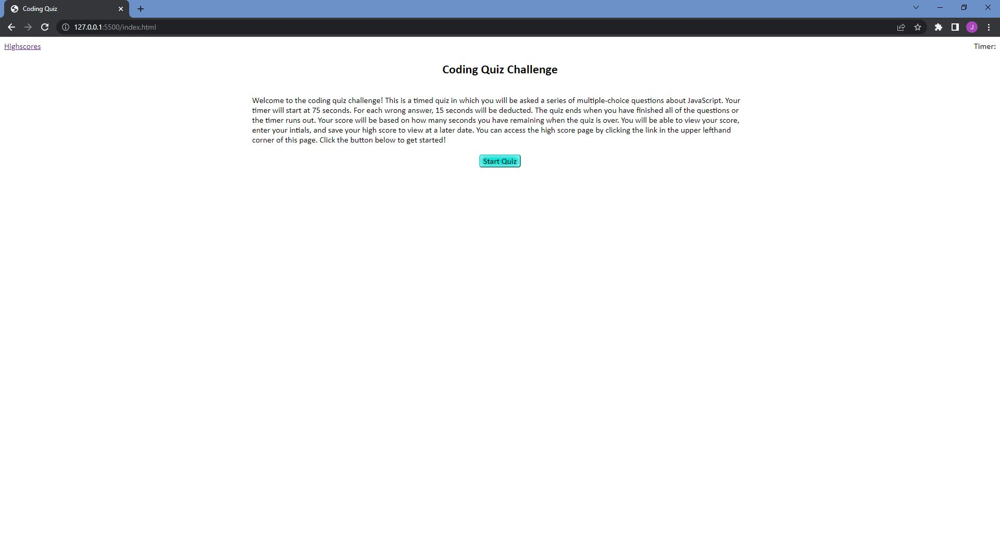

# JavaScript Quiz
## Purpose
The purpose of this project is for completion of Challenge 04 in the GA Tech Full Stack web development coding bootcamp. This project demonstrates my ability to use JavaScript to create a dynamically styled and interactive website. The user is presented with a brief description of the quiz and the rules of the quiz. When the user clicks the start quiz button, a timer starts and they are guided through a series of multiple-choice questions. Upon clicking their answer, they are given feedback on whether or not they selected the correct answer. If the user answers incorrectly, 15 seconds is deducted from the timer. When all questions are answered or the timer reaches 0, the quiz is over. The user is then propmted to submit their initials and are taken to a separate page where they can view their score. Additionally, localstorage is utilized and they are able to come back at a later date and view their score, if they did not clear the highscores before leaving.

## Screenshot

## Link to GitHub
https://jeremystevens515.github.io/coding-quiz/